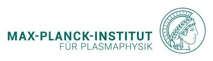

<!-- 줄바꿈: 문장 뒤에 스페이스 두번 -->
<!-- 문단 바꿈: 엔터 두번 -->
<!--  -->
<!-- [링크](URL) -->
<!-- 목록: '*' or '-' -->
<!-- **굵게** *기울여서* -->
<!-- 코드 한줄: `여기` -->
<!-- 코드 여러줄: 스페이스 4칸 들여쓰기 -->
<!-- 인용: >, >> -->

PX-PSIグループは筑波大学プラズマ研究センターの小グループの一つで、センター長の坂本瑞樹教授、数理物質系物理学域の皇甫度均助教と11名の学生が運営する研究グループです。

PX-PSIグループでは核融合炉における周辺プラズマと炉壁の相互作用に着目し、直線型プラズマ装置を用いた高温プラズマー金属壁の相互作用の研究を行っています。また、プラズマー材料相互作用の産業応用を目指して、大気圧プラズマ源の開発及びプラズマ計測を行っています。

プラズマ照射による材料の表面・内部変化に興味がある方はぜひPX-PSIグループに合流してください!

---
#### Partners
 
 
 
 
 
 

